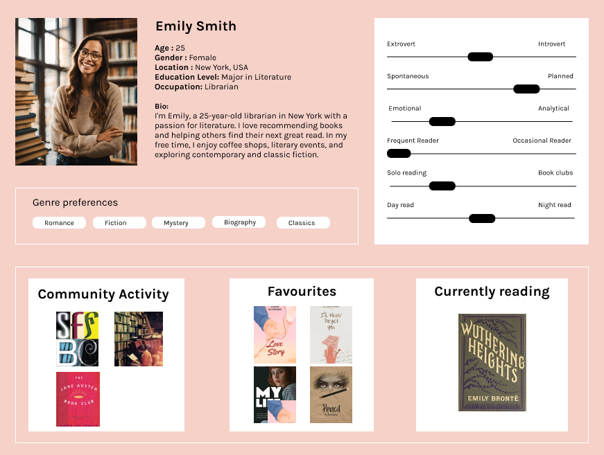
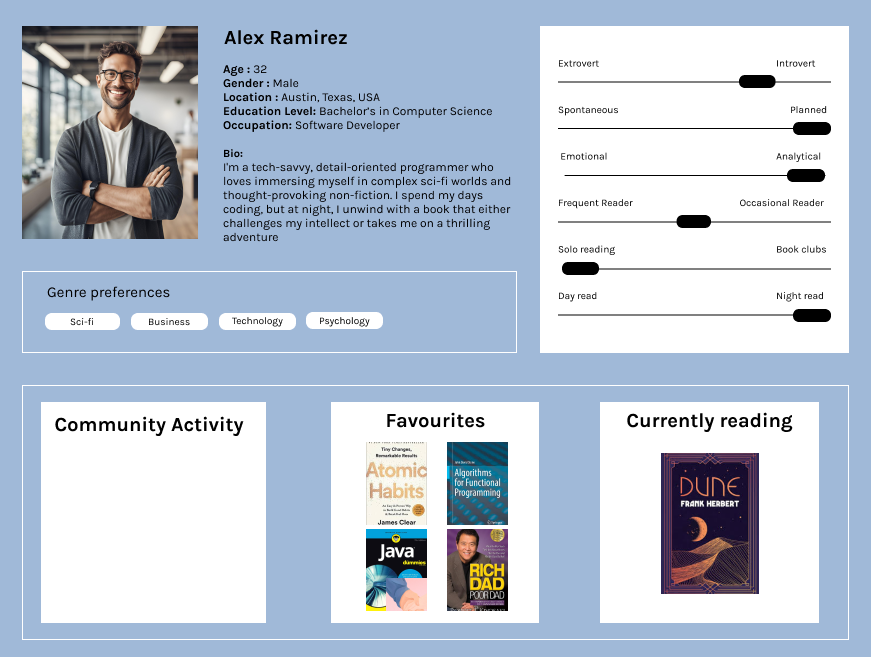
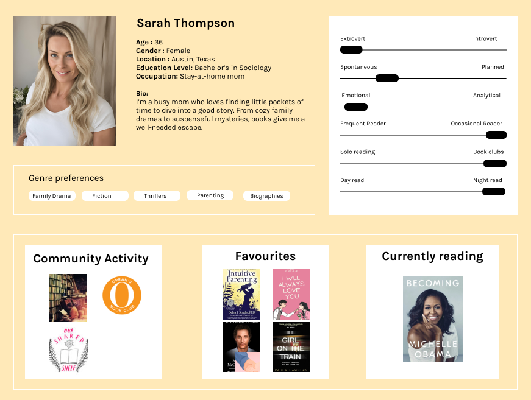
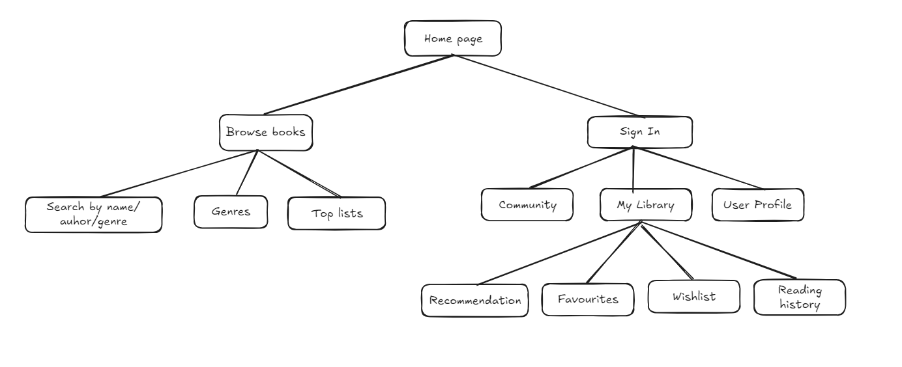

# Assignment 2

## Project Tasks:

1. **User personas**
     **Persona 1: The Bookish Librarian**
        
        
        
     **Persona 2: The Geek Programmer**
        
        
        
     **Persona 3: The Busy Mom**
        
        
        
2. **Information Architecture and Card Sorting:**
    
    **Home Page**
    
    First page user sees when entering the app.
    
    - About the platform
    - Featured content and recent updates
    
    **Sign In**
    
    Allows user to have personalized experience
    
    - **UserProfile (photo, personal information)**
    - **My Library (**books saved as **favourites,on the wishlist, history of reading**,… **)**
    - **Recommendation** based on previous books that were saved
    
    **Browse books**
    
    Available functionality to the user that are not signed in.
    
    - **Filtering books by genre** (comedy,mistery,biography,romance,…)
    - **Top books lists** (Bestsellers, Top 10 Romance Novels, New Release,…)
    - **Searching by name of the book, author’s name, genre etc.**
    
3. **Sitemap:** 

